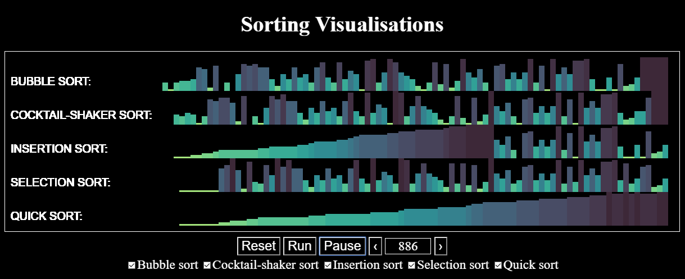

# Sorting Visualisations

#### Visualisations of different sorting algorithms using Canvas

#### Summary

This is a visualisation of several different sorting algorithms made using Canvas. I built it partly to get practice with Canvas, and partly as a teaching tool.

The algorithms currently included are bubble-sort, cocktailshaker-sort, selection-sort, insertion-sort and quicksort.

Each algorithm starts at the same time and sorts the same numbers, so you can see which is fastest. Number sets are randomly generated within a range. Using the controls provided, you can set the visualisation going and watch, or you can step through each change. All algorithms run at once by default, but you can exclude any you wish. 
